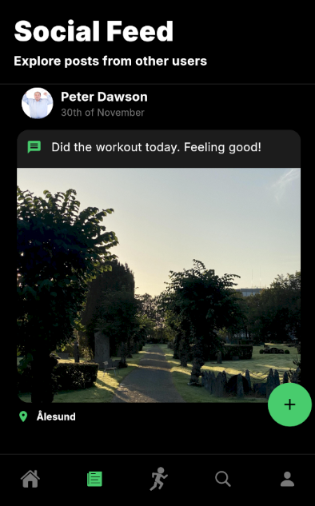
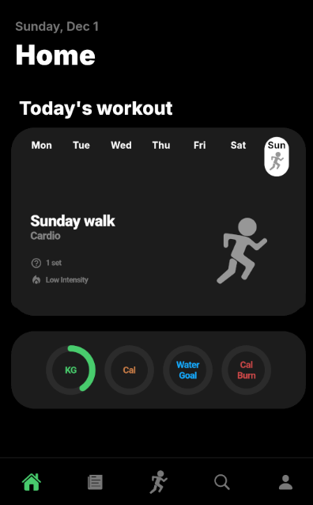
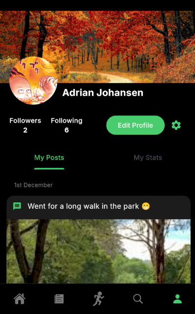

# Fitness App

Course Project For IDATA2503 Autumn 2024

## About The Project

This app allows a user to create, complete and log workouts. users can create their own exercises or pick from a range of pre-made exercises. Create your own workout routines and schedule. During your workout, you can log your progress, monitor breaks, and keep track of your weight goals. Afterwards you will be able to keep track of your progress as you continue on your physical journey.

## Services used

This project uses Firebase for cloud storage.

## Screenshots




## Installation

### iOS

To join the beta testing for iOS devices, follow these steps:

1. Install the TestFlight app from the App Store.
2. Open the following link on your iOS device: [Join Beta](https://testflight.apple.com/join/VgpVe6Y4)
3. Follow the instructions in TestFlight to install the app.

### Android

For Android devices, follow these steps:

1. Download the APK file from the [Releases](https://github.com/your-repo/releases) section.
2. Open the APK file on your Android device to install the app.
3. Follow the on-screen instructions to complete the installation.

### Development Setup

To set up the development environment, follow these steps:

Clone the repository locally on your device. Run this in your preferred directory:
```
git clone [https](https://github.com/AbsolutelyHaakon/FitnessApp-IDATA2503.git)
```

Before running the project make sure you have [Flutter](https://flutter.dev) downloaded. Then you may run this snippet of code inside the project's directory to initialize all dependencies used:
```
flutter pub get
```

When all of this is done you may run the app!
```
flutter run
```

## Project Requirements

The requirements for the projects are:

- Documentation with class diagram
- Application able to run on both iOS & Android
- User interface with multiple pages
- Show a listing of several objects
- Show a detailed listing of one object
- Navigation between pages
- Input form with validation and error messages
- Authentication with email and password towards an external server
- Storage of data in a remote databse
- CRUD operations for the storeddata

## Dependencies

* ``image_picker``: Provides image support for both iOS and Android.
* ``flutter_local_notifications``: Allows for sending push notifications between parent and child.
* ``table_calender``: Easy implementation of a simple calendar.
